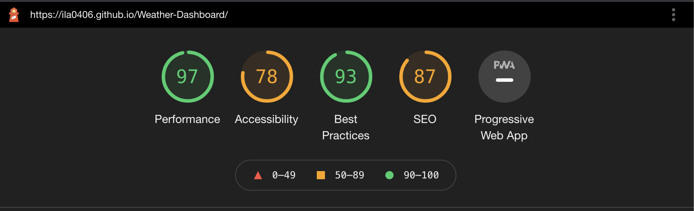

# Weather Dashboard
Homework repo for wk6 - 
https://ila0406.github.io/Weather-Dashboard/

## User Story
AS A traveler
I WANT to see the weather outlook for multiple cities
SO THAT I can plan a trip accordingly

## Mock-Up 

The following images shows the mokup of the web application's appearance and functionality. 

### Mockup

### Search for a city
I am presented with current and future conditions for that city and that city is added to the search history

### Current Weather Conditions in City
I am presented with the city name, the date, an icon representation of weather conditions, the temperature, the humidity, the wind speed, and the UV index

### UV index
I am presented with a color that indicates whether the conditions are favorable, moderate, or severe

### Future weather conditions for that city
I am presented with a 5-day forecast that displays the date, an icon representation of weather conditions, the temperature, the wind speed, and the humidity

### Search vs Click on City
I am again presented with current and future conditions for that city

## Accessibility
Lighthouse report on accesibility
