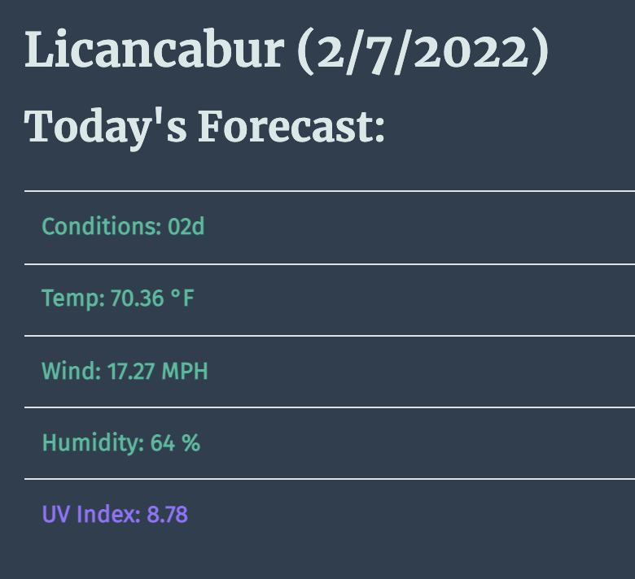

# Weather Dashboard
Homework repo for wk6 - 
https://ila0406.github.io/Weather-Dashboard/

## Description
The weather dashboard is a website that lets the user search for the weather any where in the world. Once a city is submited in the search box, and button clicked the API is called. The Weather API will return today's weather, along with the the 5-day forecast. All previously searched cities are saved in the 'Previous Searches' section of the nav bar, and can be clicked on to see the weather again. 

## Technologies Used
CSS, HTML, Javascript, APIs, Bootstrap, jQuery, Moment.js

## User Story
AS A traveler
I WANT to see the weather outlook for multiple cities
SO THAT I can plan a trip accordingly

## Mock-Up 

The following images shows the mokup of the web application's appearance and functionality. 

### Mockup

### Search for a city
I am presented with current and future conditions for that city and that city is added to the search history

### Current Weather Conditions in City
I am presented with the city name, the date, an icon representation of weather conditions, the temperature, the humidity, the wind speed, and the UV index

### UV index
I am presented with a color that indicates whether the conditions are favorable, moderate, or severe

### Future weather conditions for that city
I am presented with a 5-day forecast that displays the date, an icon representation of weather conditions, the temperature, the wind speed, and the humidity

### Search vs Click on City
I am again presented with current and future conditions for that city

## Accessibility
Lighthouse report on accesibility

## Questions
email: ila0406@gmail.com
